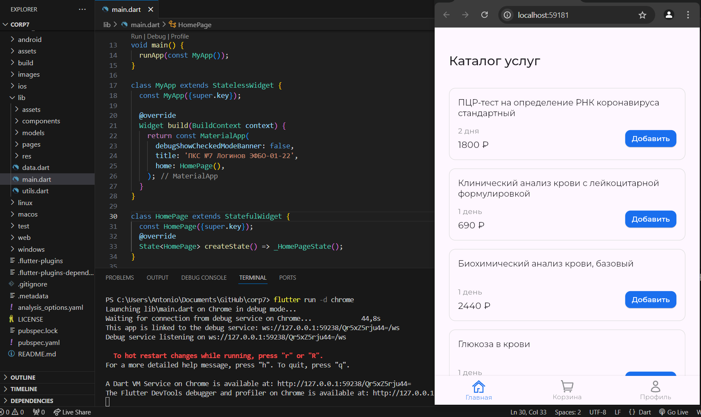
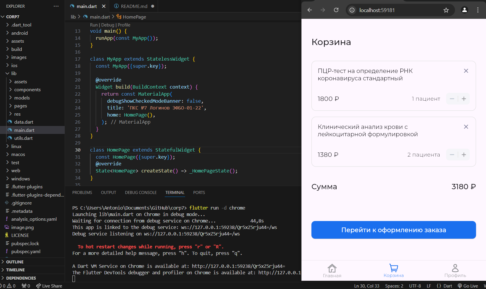
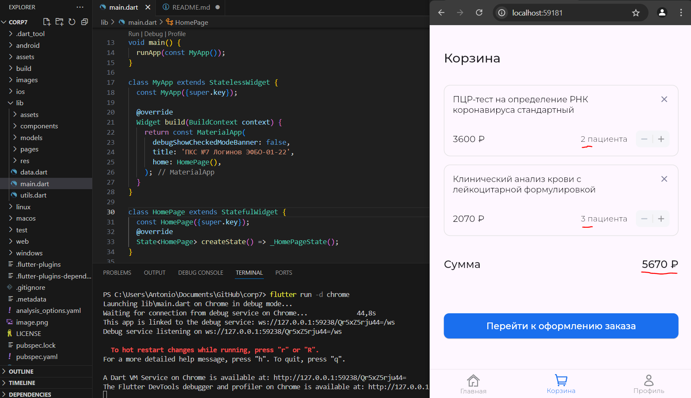
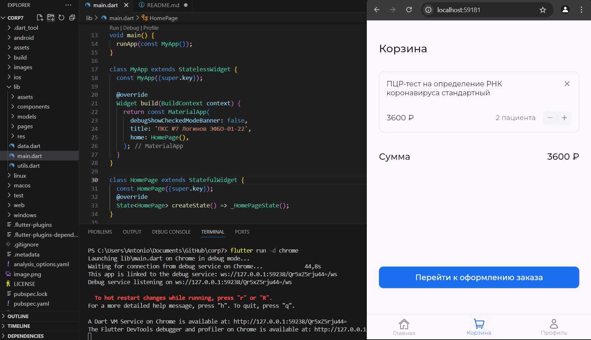
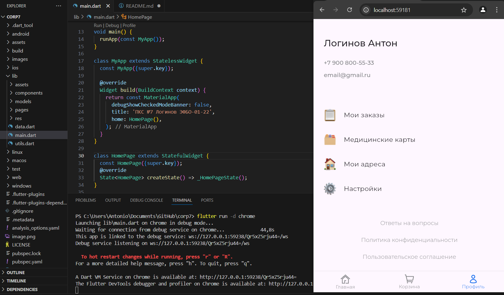

# Программирование корпоративных систем
## Практическая работа №7
Дисциплина: **Программирование корпоративных систем**  
Семестр: 5  
Выполнил студент **ЭФБО-01-22 Логинов А.М.**  

## Содержание работы
Задание: сверстать приложение по макету дизайна в Figma

